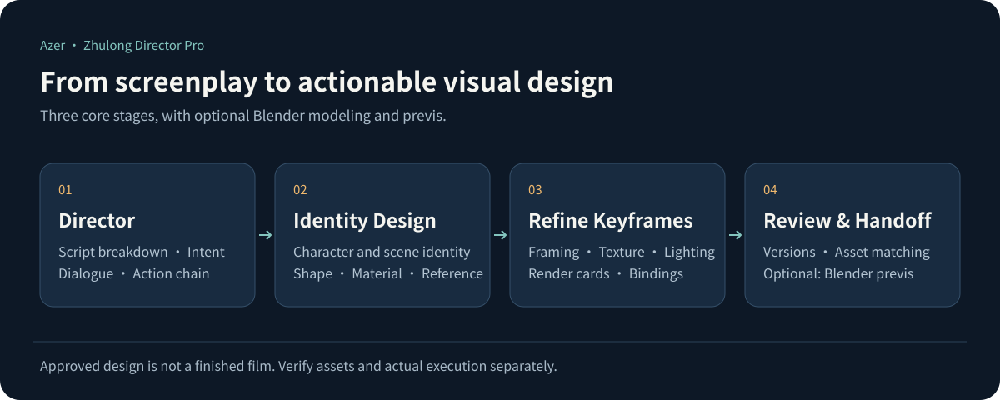
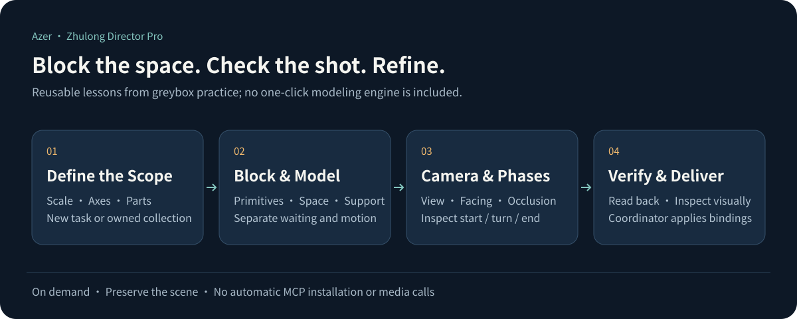

# Azer AI Director Pro | Zhulong Zaojing

[简体中文](README.md) | [English](README.en.md)

**Develop video prompts, consistent identity references, and refined keyframe plans.**

[](LICENSE)
[](CHANGELOG.md)

Part of the Azer Shanhai Creative Series: AI filmmaking workflows, agents, Skills, prompting methods, and blank templates.

Bring your own creative goal and authorized materials. The coordinator organizes staged work, review, and revision. The package does not include completed screenplays, novels, production assets, or finished films.

## Language support

Chinese and English READMEs, getting-started instructions, runtime rules, and receipt documentation are available. You can ask the agent to communicate and create new content in English. **Underlying Agent and Skill instructions remain primarily Chinese**; this is not a full translation of every method or a verified English creative end-to-end run.

Keep file names, command tokens, IDs, JSON keys, and status values unchanged. Translate existing screenplay dialogue only when explicitly requested. The host's model must be able to read the supplied method instructions.

## Choose a project

| Project | Best starting point | Workflow |
|---|---|---|
| [Feilian — Director Express](https://github.com/XAzer-R/azer-feilian-director/blob/main/README.en.md) | You have a screenplay and want shot designs and video prompts | Director → art designer → checked asset bindings |
| [Zhulong — Director Pro](https://github.com/XAzer-R/azer-zhulong-director-pro/blob/main/README.en.md) | You need more control over identity references and keyframes | Director → art designer → storyboard refinement → coordinator handoff |
| [Qingqiu — Screenwriting](https://github.com/XAzer-R/azer-qingqiu-screenplay/blob/main/README.en.md) | You want to develop an idea or authorized adaptation | Incubation → structure and characters → scenes → independent review and revision |

These projects run independently. You may hand a screenplay to a director workflow without installing the other two systems as dependencies.

## Capabilities

- Director and art-designer roles, plus a storyboard artist for keyframe refinement.
- 19 top-level Skills, loaded according to the current task.
- Explicit writer responsibilities, input versions, and review state.
- At most two automatic revision rounds; unresolved failures remain failures.
- Offline package validation and read-only review receipt checks.

## Workflow at a glance



## Optional Blender modeling and previs



The optional `blender-director` Skill covers modeling plans, basic scene construction, blocking, character placement, camera changes, and review of key motion phases. It incorporates earlier greybox lessons without shipping the old work-specific engine.

This release provides operating instructions, host entry points, and a read-only dependency probe. **It is not a one-click general modeling engine.**

In Codex, use `$blender-director`. In Claude Code, ask the coordinator to use `blender-artist`. The user chooses the model; the repository does not supply a model service or API key. Only this Blender-specific entry is provided for Codex; the entire three-role director pipeline has not been validated there.

```shell
python -B tools/blender_preflight.py
```

If Blender is not on PATH, pass `--binary` with the path to your existing executable. The probe requests only `--version`; it does not model, render, enable MCP, or modify a scene. Read the [English Blender guide](docs/en/BLENDER-GUIDE.md) before executing a task.

## Requirements

- The original role layout targets Claude Code with project `.claude/agents` and `.claude/skills` support.
- Bring your own installed host and model access. No credentials, weights, prepaid usage, or subscriptions are included.
- Python 3.10+ is needed only for the offline tools; they have no third-party Python dependencies.
- Other hosts may adapt these methods, but automatic role registration and equivalent behavior are not generally verified.

## Installation

```shell
git clone https://github.com/XAzer-R/azer-zhulong-director-pro.git
cd azer-zhulong-director-pro
python -B tools/validate.py
claude
```

An identical Gitee mirror is available at [X-zer/azer-zhulong-director-pro](https://gitee.com/X-zer/azer-zhulong-director-pro); you can clone its HTTPS URL instead. Without Git, use the hosting site's ZIP download and start your host inside the extracted repository root.

The root `CLAUDE.md` loads the runtime contract and coordinator instructions. Opening a Markdown file does not install a program.

## First task

Tell the coordinator:

```text
Please communicate in English and prepare this project for shot design.
Confirm the work type, visual direction, and target medium with me first.
Preserve the screenplay's original dialogue unless I request translation.
```

Place your own screenplay in `script/EP01.md`. Use unique segment headings such as `## S01 · Scene title`. A blank cinematography bible is not treated as completed configuration.

| Conversation input | Purpose |
|---|---|
| `~start EP01` | Process the first missing or stale director unit in an episode |
| `~start EP01-S01` | Process the specified segment |
| `~design EP01` | Design identity references after all director units pass |
| `~status` / `~help` | Inspect actual progress or available entry points |
| `~render EP01-S01` | Prepare keyframe rendering cards after identity design passes |

Send these inputs to the coordinator, not to a shell. `@图N` denotes an asset binding ID, not proof that an image has been generated or uploaded.

## Files and outputs

```text
README.md / README.en.md   Chinese and English project overviews
CLAUDE.md                  Host entry
AGENTS.md                  Repository maintenance instructions
.claude/CLAUDE.md           Coordinator workflow
.claude/agents/             Role definitions
.claude/skills/             Methods and templates
docs/en/                   English operating documentation
tools/                     Read-only validation tools
tests/                     Isolated regression tests
project.json               Release metadata
```

Screenplays live in `script/`, identity designs in `assets/`, and production cards in `outputs/`. The Pro workflow also writes storyboard/keyframe rendering cards there.

Work directories are ignored by Git. A few director `assets/` templates are already tracked: after you fill them in, their contents appear as changes. Review your diff and do not blindly commit all production files.

## Validation

```shell
python -B tools/validate.py
python -B -m unittest discover -s tests
python -B tools/workflow_guard.py unit EP01-S01
```

For actual review records, use the command and schema in [Review receipts](docs/en/REVIEW-RECEIPTS.md). Current file hashes establish version consistency, not artistic quality or cryptographic approval.

## What has and has not been verified

Package validation, offline regression tests, and clean-clone checks passed for the published baseline. See the [source runtime review](docs/RUNTIME-REVIEW.md), currently in Chinese, for recorded details.

No real-model creative run, full Claude Code workflow, media generation, or English-language end-to-end run is claimed. A readable method package is not a guarantee of one-click filmmaking. Platform limits and actual image/video outcomes require separate verification.

Read the [English runtime contract](docs/en/RUNTIME-CONTRACT.md) for review limits, stale results, file ownership, missing inputs, and execution permissions.

## Contributing, security, and license

See the [English contribution and security guide](docs/en/CONTRIBUTING-SECURITY.md). Provide minimal, sanitized reproduction steps. Do not upload unpublished scripts, complete novels, client data, unlicensed film frames, credentials, or private logs.

Author: **Azer (阿泽)**. Licensed under [MIT](LICENSE). Retain the copyright and license notice when using, modifying, or distributing the package. Methodological references do not imply third-party endorsement; see [NOTICE](NOTICE.md).

The series names use Chinese mythological imagery as branding; they are not presented as quotations or literal functional definitions from ancient texts.
