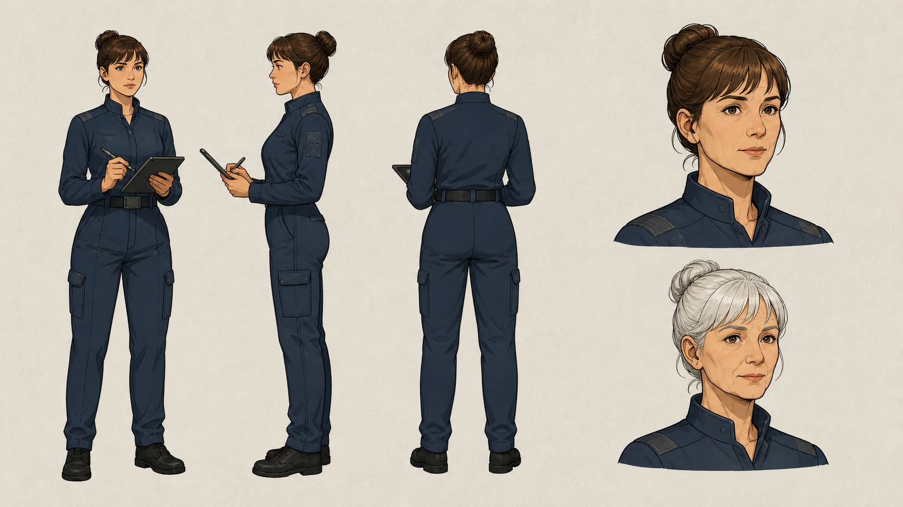

# 作者历史作品展示

本页只展示经用户授权精选的历史视觉成果。它来自作者既有创作实践，不表示当前 0.2.0 开源版已经自动生成或能够一键复现。

## 手绘角色设定

展示重点：正侧背轮廓、服装和发型一致性、面部特征保持以及年龄变化设计。选图不附作品名称、完整剧情、源提示词或制作资产包。

白模效果图按用户要求不展示；Blender 能力仅用功能图解说明。

## 使用范围

仓库代码、方法文档和自制功能图解采用根目录 MIT 许可；本目录的历史作品图仅作展示，未另行授予复制分发或商用许可。需要用于其他项目，请先联系作者。文件哈希见 manifest.json。
